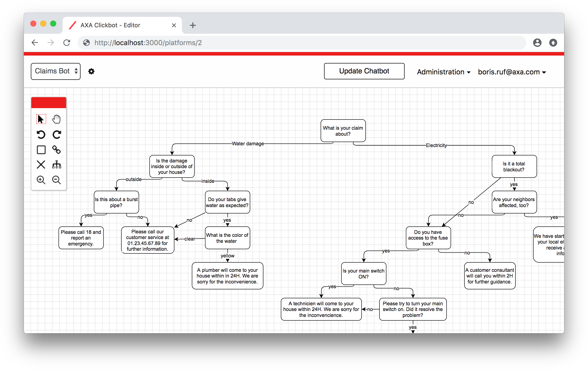
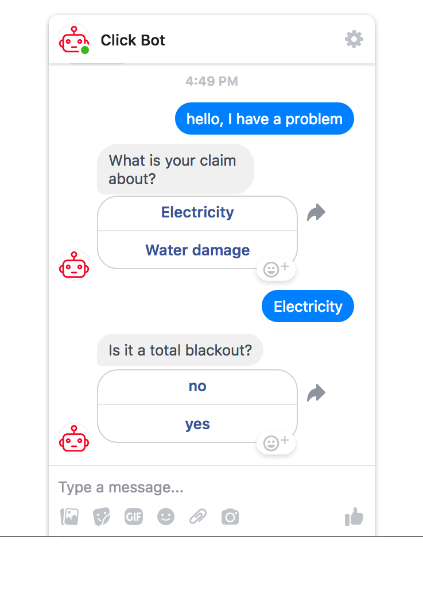

# Click Bot Framework

A robust, decision-tree backed chatbot framework to manage conversations via Facebook messenger. 

<div>
  
  &nbsp;&nbsp;&nbsp;
  
</div>

## Description

This code was developed by the [AXA REV research team](https://axa-rev-research.github.io/) to serve as prototype for a chatbot framework to handle complex dialogues which involve plenty of questions and answers.

Main features:

- Robust conversation flow based on directed graph (no loops or dead ends)
- Intuitive, [mxGraph](https://github.com/jgraph/mxgraph) powered user interface which allows for rapid design and update of conversation flows
- Simple integration with [Facebook messenger](https://www.messenger.com/)
- Multi-tenancy: Operate multiple chatbots within one framework
- User authentication using [Devise](https://github.com/plataformatec/devise) and role-based user authorization using [cancancan](https://github.com/CanCanCommunity/cancancan)
- Action hooks: Integration of external APIs (including OAuth2 authentification)
- Off topics: Handle arbitrary messages with built-in NLP engine based on [fastText](https://fasttext.cc/)

## Setup

### 0. Requirements
- Ruby 2.4.1+
- [bundler](https://bundler.io/), `gem install bundler`
- A database, e.g. MySQL, PostgreSQL, Oracle

### 1. Web application

Clone the respository and install the required gems:
```
bundle install
```

Generate secret keys for the `development` and `test` sections in [config/secrets.yml](config/secrets.yml):

```
rake secret
```

Create the database and load the schema:
```
rake db:setup
```

Open the Rails console with `rails c` and create your admin account: 
```
User.create(email: "name@domain.com", password: "TOPSECRET_PASSWORD", password_confirmation: "TOPSECRET_PASSWORD", role: "admin")
```
Startup your local web server:
```
rails s
```
Login in at http://localhost:3000 and create your first click bot project.

### 2. Facebook integration

- Create a Facebook page and [setup a Facebook app](https://developers.facebook.com/docs/messenger-platform/getting-started/app-setup)
- In the Messenger section, create a *page access token* and add it to the settings of your click bot project. In the Webhooks section, edit the page subscription and provide your app's *callback url* and a random *verification token*
- Add the token to your click bot project's settings to complete the integration

For testing in your development environment, you will need to expose the Webhook url of your local server to the internet. This can be achieved using [Ngrok](https://ngrok.com/).

### 3. Action hooks (optional)

Use *action hooks* in order to integrate any external web services. As blueprint you can customize the stub provided in [lib/external_service.rb](lib/external_service.rb) and call the service in the leaf node [lib/chatbot.rb](lib/chatbot.rb#L132).

### 4. Off-topics (optional)

Use *off-topics* to handle arbitrary messages that go beyond the provided options. 

- Install [fastText](https://github.com/facebookresearch/fastText) in your environment
- Provide the path to the binary and also the path to the directory where you store the classifiers in [config/classifiers.yml](config/classifiers.yml)
- Download the *text* files of the [pretrained vectors](https://github.com/facebookresearch/fastText/blob/master/pretrained-vectors.md) for the languages of your interest to a directory "pretrained_vectors" located in your fastText directory
- Create the off-topics you would like to  manage, provide a few sample messages and train the classifier

## Contact

For questions, please contact boris.ruf@axa.com.

## MIT License

Copyright (c) GIE AXA Services France SAS

Permission is hereby granted, free of charge, to any person obtaining a copy of this software and associated documentation files (the "Software"), to deal in the Software without restriction, including without limitation the rights to use, copy, modify, merge, publish, distribute, sublicense, and/or sell copies of the Software, and to permit persons to whom the Software is furnished to do so, subject to the following conditions:

The above copyright notice and this permission notice shall be included in all copies or substantial portions of the Software.

THE SOFTWARE IS PROVIDED "AS IS", WITHOUT WARRANTY OF ANY KIND, EXPRESS OR IMPLIED, INCLUDING BUT NOT LIMITED TO THE WARRANTIES OF MERCHANTABILITY, FITNESS FOR A PARTICULAR PURPOSE AND NONINFRINGEMENT. IN NO EVENT SHALL THE AUTHORS OR COPYRIGHT HOLDERS BE LIABLE FOR ANY CLAIM, DAMAGES OR OTHER LIABILITY, WHETHER IN AN ACTION OF CONTRACT, TORT OR OTHERWISE, ARISING FROM, OUT OF OR IN CONNECTION WITH THE SOFTWARE OR THE USE OR OTHER DEALINGS IN THE SOFTWARE.
